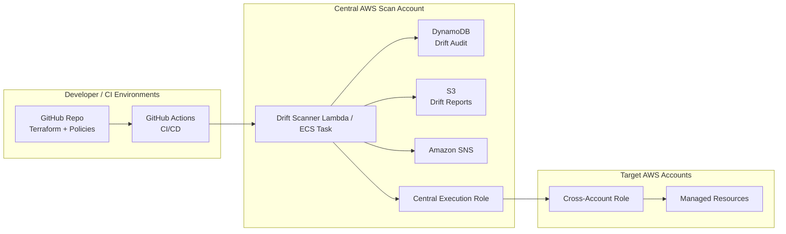

# Terraform Drift Detection Platform – Threat Model

This document outlines the **threat model** for the Terraform Drift Detection &
Auto-Remediation Platform, including trust boundaries, key assets, threats, and
mitigations.

---

## 1. Scope

In scope:

- Drift scanner (Lambda / CLI) and its IAM roles.
- Terraform configuration, state, and execution environment.
- DynamoDB audit table and S3 drift report bucket.
- SNS notifications.
- Optional GitHub Issues & Actions integration for remediation.

Out of scope:

- Underlying AWS infrastructure security (handled by cloud provider).
- Generic endpoint/device security of operators’ laptops.

---

## 2. Trust Boundaries

### Key Trust Boundaries

1. **GitHub → AWS**
   - Workflows must use secure credentials (OIDC or minimal IAM users/roles).
2. **Central Scan Account → Target Accounts**
   - Cross-account roles must be least-privilege and scoped to resources under
     management.
3. **Scanner → Data Stores**
   - Only the scanner should have permissions to write to DynamoDB and S3
     audit resources.

---

## 3. Assets

- **Terraform State**
  - Accurate reflection of desired and actual resources.

- **Drift Policies**
  - Define severity and remediation behavior.

- **Audit Records (DynamoDB + S3)**
  - Provide historical evidence of drift and responses.

- **AWS Credentials & IAM Roles**
  - Central execution role.
  - Cross-account roles in target accounts.

- **GitHub Repo & Workflows**
  - Contain code and automation that can make infrastructure changes.

---

## 4. Threats & Mitigations

### 4.1 Compromise of Drift Scanner Role

**Threat**

An attacker gains access to the scanner’s IAM role or environment and:

- Reads/modifies audit data.
- Assumes cross-account roles.
- Manipulates drift detection outcomes.

**Mitigations**

- Use **least-privilege IAM** for the scanner role:
  - Restrict permissions to exact DynamoDB tables, S3 buckets, and SNS topics.
  - Limit STS AssumeRole to specific cross-account role ARNs.
- Enable **CloudTrail** and **CloudWatch** logging for access patterns.
- Use **short-lived credentials** (e.g., no long-lived access keys in code).
- Rotate keys regularly; use AWS-managed credentials where possible.

---

### 4.2 Malicious or Misconfigured Policies

**Threat**

Malicious or careless edits to `drift_policies.yml` could:

- Downgrade severity for sensitive drift.
- Mark dangerous drift as eligible for auto-remediation.

**Mitigations**

- Store policies in **version control** with:
  - Protected branches.
  - Required reviews from security/SRE.
- Add **policy unit tests** in `tests/` that:
  - Assert critical resources are always at least `HIGH` severity.
- Optionally sign or hash policy files and verify at runtime.

---

### 4.3 Unauthorized Auto-Remediation

**Threat**

An attacker or misconfiguration triggers unwanted `terraform apply`, leading to:

- Service outages.
- Security posture degradation.

**Mitigations**

- Separate **detection** from **remediation**:
  - Detection is automatic.
  - Remediation requires explicit GitHub approval (Issue labels/comments).
- Limit auto-remediation eligibility in policies to **low-risk changes**.
- Use GitHub Protected Branches and required reviewers for any changes to
  workflows that perform `terraform apply`.

---

### 4.4 Abuse of Cross-Account Roles

**Threat**

If cross-account roles are over-privileged, an attacker could:

- Access or modify resources beyond Terraform’s scope.

**Mitigations**

- Define cross-account roles using the **`cross-account-role` module** with:
  - Minimal permissions required for read operations and drift detection.
  - For remediation, scope write permissions to resources explicitly managed
    by Terraform.
- Restrict the **trust relationship** to the central scan account only.

---

### 4.5 Tampering with Audit Trail

**Threat**

An attacker attempts to delete or modify drift history to hide their actions.

**Mitigations**

- Enable S3 **versioning** and, if required, **object lock** on the reports
  bucket.
- Limit delete permissions on S3 and DynamoDB tables.
- Use **CloudTrail** to log and alert on delete or update events for audit
  resources.

---

### 4.6 Data Exfiltration via Reports

**Threat**

Drift reports may contain sensitive resource metadata that could be exfiltrated
if S3 permissions are too broad.

**Mitigations**

- Restrict S3 bucket access to:
  - The scanner role.
  - Specific IAM principals that require access (e.g., security analysts).
- Consider encryption with KMS and strict key policies.

---

### 4.7 Supply Chain Risks (Terraform / Providers / Libraries)

**Threat**

Compromise of:

- Terraform binary or providers.
- Python dependencies in `requirements.txt`.

**Mitigations**

- Pin dependencies to vetted versions.
- Use **checksum verification** for Terraform downloads (in CI).
- Periodically review `pip` and provider vulnerability advisories.

---

## 5. Logging & Observability

To support detection and forensics:

- Enable **structured JSON logging** in the Python scanner:
  - Include correlation IDs, environment, account ID, drift ID, severity.
- Ship logs to:
  - CloudWatch Logs.
  - Optional centralized log analytics platform.
- Set up alerts for:
  - Repeated scanner failures.
  - High volume of critical drift events.

---

## 6. Summary

The platform is built with:

- Clear **trust boundaries** between GitHub, the central scan account, and
  target accounts.
- Strong emphasis on **least privilege**, **immutable audit**, and
  **human-in-the-loop remediation**.

Security is shared:

- The platform enforces structure and good defaults.
- Operators must maintain good practices around policies, credentials, and
  change management.

